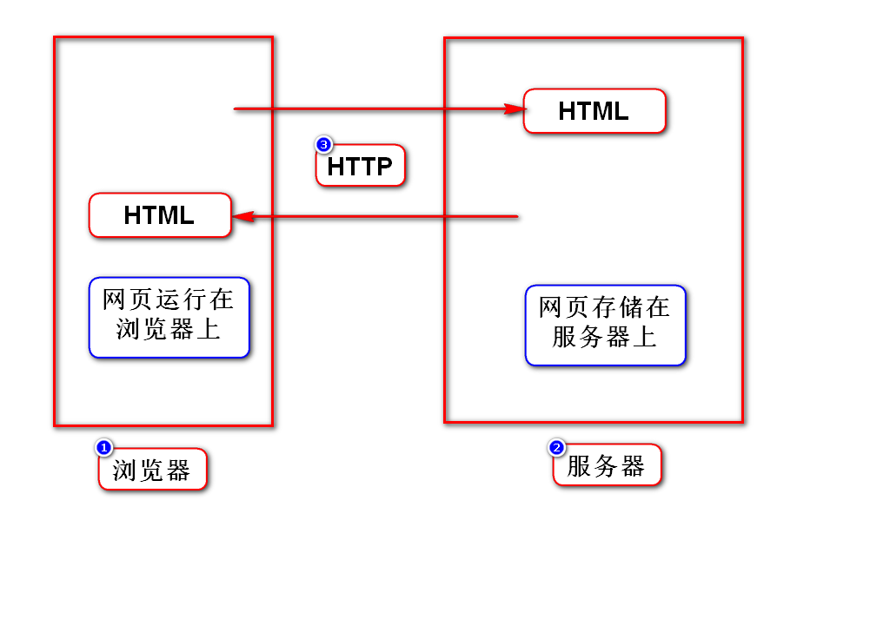
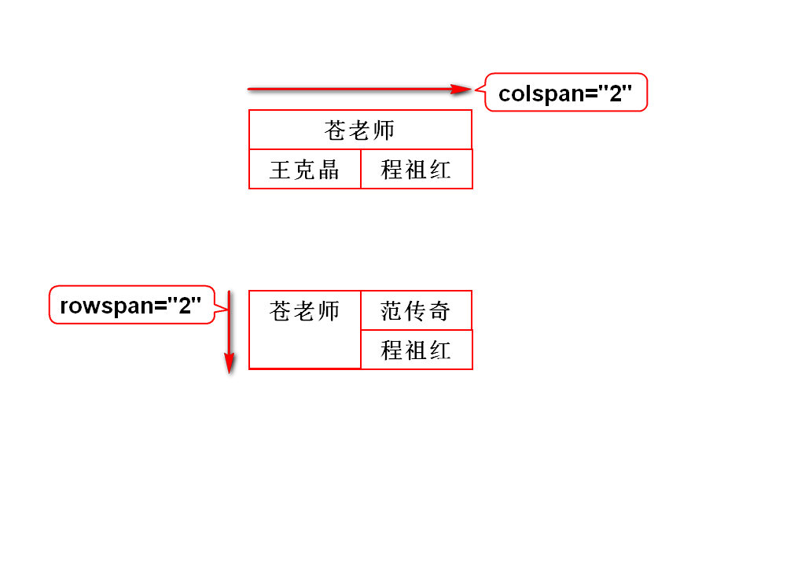
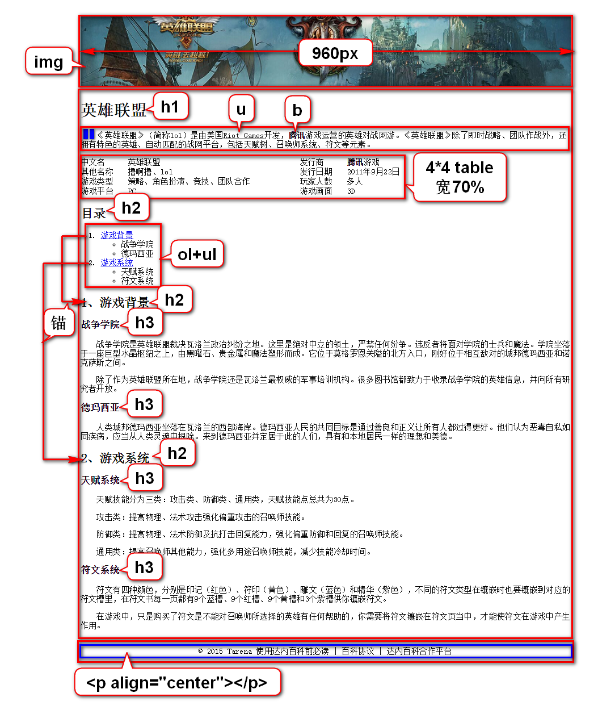

# 一、课程介绍
## 1.HTML(1.5天)
- 勾勒出网页的结构和内容

## 2.CSS(3天)
- 美化网页

## 3.JavaScript(4天)
- 让网页呈现动态的数据和效果

# 二、WEB三要素

# 三、XML和HTML的联系
## 1.XML
- 可扩展(自定义)标签语言
- 标签、属性、标签之间的嵌套关系均可扩展
- 作用：存储/传输数据

## 2.HTML
- 超文本标签语言
- 标签、属性、标签之间的嵌套关系均固定(w3c)
- 作用：显示数据
- HTML有些版本就完全遵守XML规范
> 可以将HTML理解为标签固定的XML

# 四、跨行和跨列

# 五、英雄联盟案例
## 1.分3个区域(div)
- 给它们加边框，便于调试大小和位置
- 将它们水平居中
- 它们宽都是960px

	style="border:1px solid red;width:960px;margin:0 auto;"

## 2.页面的构成

# 补充
## 1.创建WEB项目注意事项
- Eclipse右上角选择JAVAEE
- 创建MAVEN项目时最后一步选择war
- 选择项目的deployment选项，右键点击Generate...
- 网页放在webapp下

