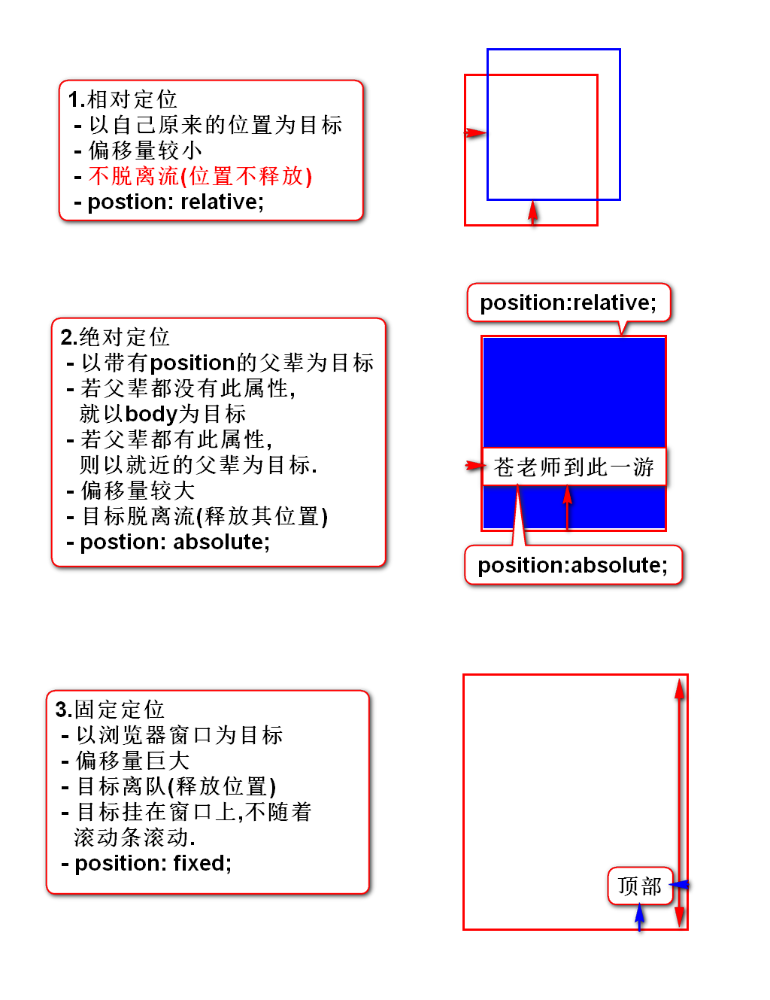
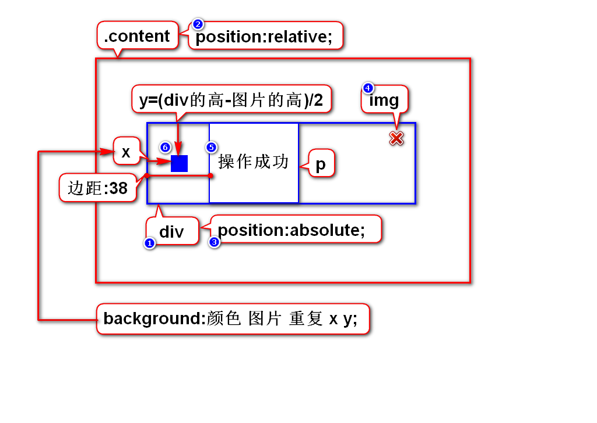

# 一.定位
## 1.定位的作用
- 定位用来解决元素的排列(摆放)问题
> 使用定位可以随心所欲的摆放元素

## 2.定位的分类
### 1)默认的定位
- 块元素垂直排列
- 行内元素水平排列
- 这种默认的排列方式叫做流定位
> 元素有序排列而形成的队伍称之为流

### 2)特殊的定位(*)
- 浮动定位:可以让块左右排列.
- 相对定位:以自己原来位置为目标产生偏移.
- 绝对定位:以父元素为目标产生偏移.
- 固定定位:以窗口为目标产生偏移.

# 二.浮动定位
## 1.浮动的介绍
### 1)浮动的作用
- 可以让块左右排列

### 2)浮动的分类
- 左浮动:可以让块按照正序左右排列.
- 右浮动:可以让块按照倒序左右排列.

### 3)浮动的步骤
1. 目标离队(流)
2. 弟弟跟上
3. 目标去左/右

## 2.画图说明浮动的规律

## 3.照片墙案例

# 三.相对,绝对,固定定位
## 1.它们的相同点和不同点
- 相同点:它们设置偏移的方式一样.
- 不同点:设置偏移时参考的目标不同.

## 2.如何设置偏移
- 以任意一边为准向中心方向偏移则是正数
- 举例: left:20px;

## 3.以案例来阐述不同的定位

# 四.定位的选择
1. 固定定位:看元素是否要挂在窗口上.
2. 浮动定位:元素是否要水平排列.
3. 相对定位:元素的偏移量是不是很小,位置是不是不释放.
4. 绝对定位:除上述3种方式之外(10S之内没想出来).

# 五.管理员列表(第5版)

# 六.元素的显示方式
## 1.有三种方式
### 1)块
- 特征:有宽高,垂直排列
- h,p,ol,ul,div,table,form

### 2)行内
- 特征:无宽高,水平排列
- span(b,strong,i,em,u,del),a,label

### 3)行内块
- 特征:有宽高,水平排列
- img,input,select,textarea

## 2.如何修改显示方式
- 块: display:block;
- 行内: display:inline;
- 行内块: display:inline-block;
- 隐藏(*): display:none;