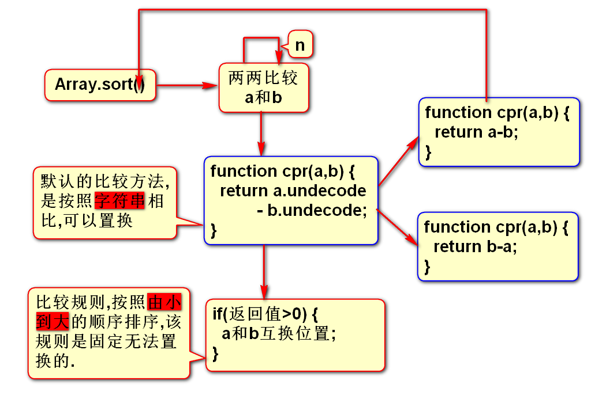
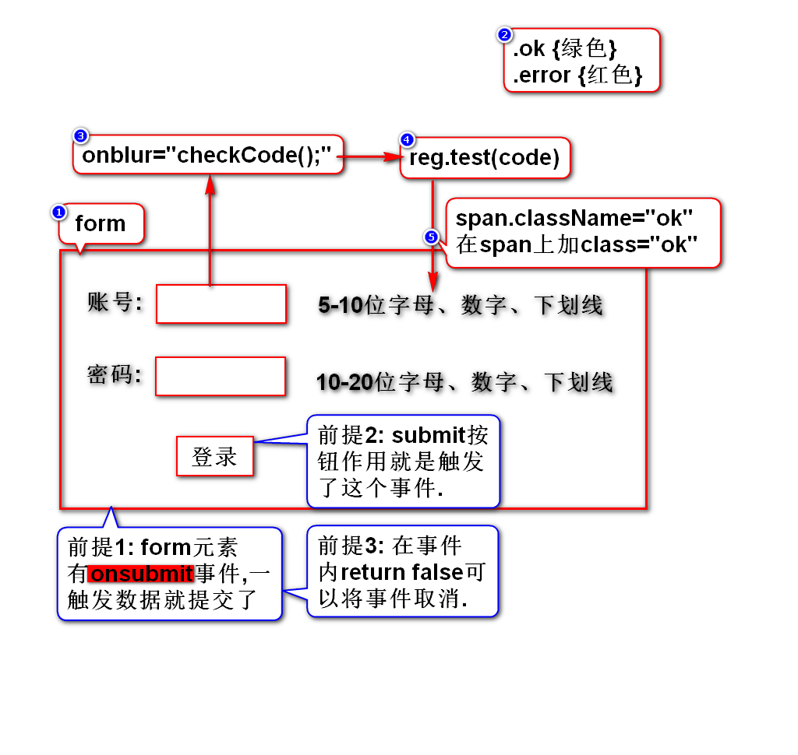
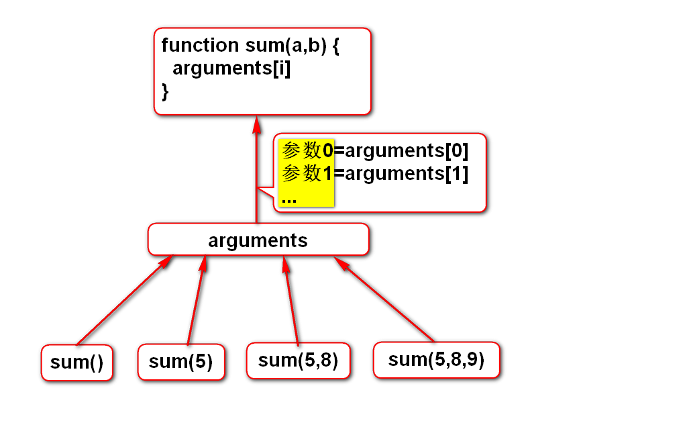

# 一.内置对象
## 1.String
- js的String有length属性,Java的String有length()
- js比Java多了一个方法str.charCodeAt(n)
- js比Java少了一个方法str.replaceAll()

## 2.Number(*)
- num.toFixed(n)

## 3.Boolean
- 没有什么方法需要了解

## 4.Array(*)
- 如何创建数组
- 数组的倒转方法
- 数组的排序方法(*)

## 5.Math
- 和Java类似,了解

## 6.Date
- 如何创建日期
- 如何获取本地的日期字符串
- 如何获取/修改时间分量

## 7.RegExp(*)
### 1)如何创建正则对象
- var reg = /\d/g;
- var reg = new RegExp("\\d","g");

### 2)检测模式
- g: global,全局模式
- i: ignore,忽略大小写

### 3)正则对象提供的方法
- reg.test(str) *
- reg.exec(str) 

### 4)字符串支持正则的方法
- str.replace(reg,"") *
- str.match(reg)
- str.search(reg)

### 5)案例

## 8.Function
- arguments *
- eval() *

