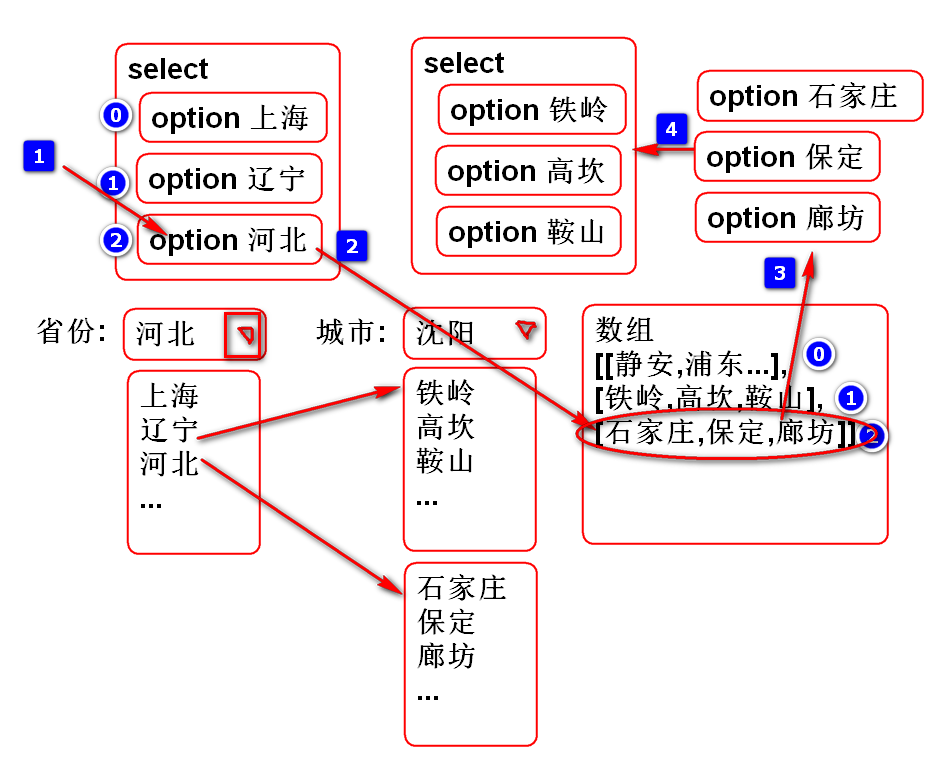
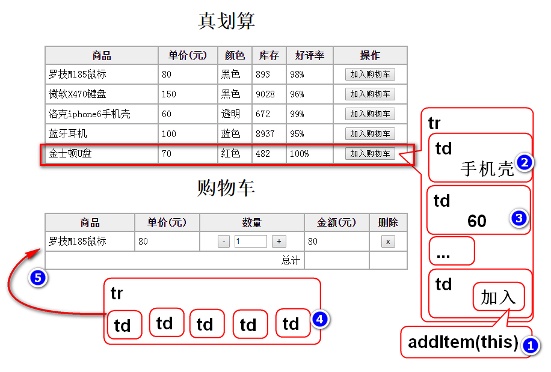
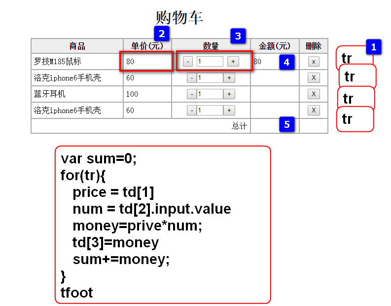

# JavaScript

## DOM 元素查询

如果需要操作 HTML 元素，必须首先找到该元素

查询节点的方式

- 通过 id 查询
- 通过层次（节点关系）查询
- 通过标签名称查询
- 通过 name 属性查询

### 通过 id 查询

语法:

	e = document.getElementById(元素ID)

### 通过层次（节点关系）查询

- parentNode
	- 遵循文档的上下层次结构，查找单个父节点
- childNodes 
	- 遵循文档的上下层次结构，查找多个子节点

> 提示: 不用使用childen属性, 这个属性是Chrome浏览器专用属性, 其他浏览器不一定支持, 这种现象就是浏览器兼容问题, 是普遍问题. 建议使用通用API实现代码, 避免兼容性问题.

### 根据标签名查询节点

- getElementsByTagName()
	- 根据指定的标签名称返回所有的元素
	- 忽略文档的结构查找整个 HTML 文档中的所有元素(子孙元素)
	- 如果标签名称错误，则返回 长度为 0 的节点列表
- 返回一个节点列表（数组）
	- 使用节点列表的 length 属性获取个数
	- [index]：定位具体的元素

案例:

	function test(){
		//按照ID查询
		var ul = document.getElementById("hello");
		var div = ul.parentNode;
		console.log(div);
		var childen=ul.childNodes;
		console.log(childen);
		var elements=ul.getElementsByTagName('li');
		console.log(elements);
		//遍历子节点
		for(var i=0; i<childen.length; i++){
			var node=childen[i];//文本/元素
			if(node.nodeType==1){//元素
				console.log(node);
			}
		}
	}

### 根据 name 属性查询节点	

- document.getElementsByName()
	- 根据标签的 name 属性的值进行查询

> 适合在表单中查询名字相同的 选项框 (单选/复选)

案例:

	function checkout(){
		var car = document.getElementById('car');
		var inputs = 
			car.getElementsByTagName('input');
		//获取 name 是 item 的全部元素
		var items = 
			document.getElementsByName('item');
		console.log(car);
		console.log(inputs);
		console.log(items);
	}

完整案例:

	<!DOCTYPE html>
	<html>
	<head>
	<meta charset="UTF-8">
	<title>按照层次关系查询</title>
	
	</head>
	<body>
		<h1>按照层次关系查询</h1>
		<input type="button" value="测试"
			onclick="test()"> 
		

			<ul id="hello">
				<li><a href="#hello">您好</a></li>
				<li><a href="#hello">Hello</a></li>
				<li><a href="#hello">牙买碟</a></li>
				<li><a href="#hello">吃了吗</a></li>
				<li>Demo
					<ul>
						<li>Tom</li>
					</ul>
				</li>
			</ul>
		

		
		

			<ul>
				<li>
					<input type="checkbox" 
						name="item" value="1">苹果
				</li>
				<li>
					<input type="checkbox" 
						name="item" value="2">小米
				</li>
			</ul>
			<input type="button" value="结账" 
				onclick="checkout()"> 
		

		
	</body>
	</html>
	
## 添加节点

DOM API 提供了添加元素的方法;

添加元素步骤:

1. 创建元素
	- 新元素=document.createElement(元素名)
2. 追加元素
	- 父元素.appendChild(新元素)

案例:

	//追加新元素
	var li = document.createElement('li');
	li.innerHTML='Andy';
	var ul = document.getElementById('demo');
	ul.appendChild(li);

插入元素步骤:
	
1. 创建新元素
	- 新元素=document.createElement(元素名)
2. 插入元素
	- 父元素.insertBefore(新元素, 参考位置元素)
	- 在 **参考位置元素** 之前插入新元素

案例:

	//插入新元素
	li = document.createElement('li');
	li.innerHTML='Mac';
	var tom=ul.getElementsByTagName('li')[0];
	ul.insertBefore(li, tom);

### 删除元素

删除元素步骤:

1. 找到父元素
2. 找到子元素
3. 从父元素中删除子元素
	- 父元素.removeChild(子元素)

案例:

	var ul = $('demo');
	var li = ul.getElementsByTagName('li')[0];
	//删除元素
	ul.removeChild(li);

完整案例:

	<!DOCTYPE html>
	<html>
	<head>
	<meta charset="UTF-8">
	<title>Insert title here</title>
	
	</head>
	<body>
		<h1>添加元素</h1>
		<!-- ul.insertBefor(new, tom) -->
		<input type="button" value="测试"
			onclick="test()">	
		<ul id="demo">
			<li>Tom</li>
			<li>Jerry</li>
		</ul>
		
删除列表

		<input type="button" value="删除"
		  onclick="removeLi()">
		<ul id="list">
		
		</ul>
	</body>
	</html>

### 经典案例 级联菜单

分析:

	

代码:

	<!DOCTYPE html>
	<html>
	<head>
	<meta charset="UTF-8">
	<title>Insert title here</title>
	
	</head>
	<body>
		<h1>联动菜单</h1>
		省份:
		<select id="province" 
			onchange="changeCities(this);">
			<option value="0">请选择</option>
			<option value='1'>上海</option>
			<option value='2'>辽宁</option>
			<option value='3'>河北</option>
		</select>
		城市:
		<select id="city">
			<option value='0'>请选择</option>
		</select>
	</body>
	</html>

> 提示: 必须逐步测试!!!

### 经典案例: 购物车

添加商品:

案例:

	function add_shoppingcart(btn){
		//console.log(btn);
		var tr = btn.parentNode.parentNode;
		//console.log(tr);
		//找到全部td
		var tds = tr.getElementsByTagName('td');
		//console.log(tds);
		//获取商品名
		var name=tds[0].innerHTML;
		var price=parseFloat(tds[1].innerHTML);
		//console.log(name);
		//console.log(price);
		//将商品信息添加到购物车表格
		var tr = document.createElement('tr');
		tr.innerHTML='<td>'+name+'</td>'+
			'<td>'+price+'</td>'+
			'<td align="center">'+
        	'<input type="button" value="-" onclick="changeNum(this, -1);">'+
        	'<input type="text" size="3" readonly value="1"/>'+
        	'<input type="button" value="+" onclick="changeNum(this, 1);">'+
      	'</td>'+
			'<td></td>'+
			'<td align="center"><input type="button" value="X" onclick="removeItem(this);"></td>';
		//console.log(tr);
		//将tr插入到购物车
		var tbody=document.getElementById('goods');
		tbody.appendChild(tr);
		total();
	}

计算总价:

案例:

	//计算商品总价
	function total(){
		//console.log('total()');
		var tbody=$('goods');
		var trs = 
			tbody.getElementsByTagName('tr');
		console.log(trs);
		var sum = 0;
		for(var i=0; i<trs.length; i++){
			var tr = trs[i];
			console.log(tr);
			var tds=tr.getElementsByTagName('td');
			console.log(tds);
			//获取商品的价格
			var price=parseFloat(
					tds[1].innerHTML);
			console.log(price);
			//获取数量值 
			var num = parseInt(tds[2]
				.getElementsByTagName('input')[1]
				.value);
			console.log(num);
			//计算金额
			var money = num*price;
			tds[3].innerHTML=money.toFixed(2);
			//累计总价
			sum += money;
		}
		//将总价写到 tfoot中
		$('total').innerHTML=sum.toFixed(2);
	}

增加/减少数量:

	function changeNum(btn, n){
		//console.log(n);
		//找到当前的num
		var input=btn.parentNode
			.getElementsByTagName('input')[1];
		console.log(input);
		var num = parseInt(input.value);
		console.log(num); 
		//增加/减少
		num += n;
		//检查是否<=0
		if(num<=0){
			return;
		}
		//更新 input.value
		input.value = num;
		total();
	}

删除商品:

	function removeItem(btn){
		var tr=btn.parentNode.parentNode;
		var tbody = $('goods');
		tbody.removeChild(tr);
		total();
	}

完整案例:

	<!DOCTYPE html>
	<html>
	  <head>
	    <title>购物车</title>
	    <meta charset="utf-8" />
	    
	    
	  </head>
	  <body>
	    <h1>真划算</h1>
	    <table>
	      <tr>
	        <th>商品</th>
	        <th>单价(元)</th>
	        <th>颜色</th>
	        <th>库存</th>
	        <th>好评率</th>
	        <th>操作</th>
	      </tr>   
	      <tr>
	        <td>罗技M185鼠标</td>
	        <td>80</td>
	        <td>黑色</td>
	        <td>893</td>
	        <td>98%</td>
	        <td align="center">
	          <input type="button" value="加入购物车" 
	          	onclick="add_shoppingcart(this);"/>
	        </td>
	      </tr>
	      <tr>
	        <td>微软X470键盘</td>
	        <td>150</td>
	        <td>黑色</td>
	        <td>9028</td>
	        <td>96%</td>
	        <td align="center">
	          <input type="button" value="加入购物车" onclick="add_shoppingcart(this);"/>
	        </td>
	      </tr>
	      <tr>
	        <td>洛克iphone6手机壳</td>
	        <td>60</td>
	        <td>透明</td>
	        <td>672</td>
	        <td>99%</td>
	        <td align="center">
	          <input type="button" value="加入购物车" onclick="add_shoppingcart(this);"/>
	        </td>
	      </tr>
	      <tr>
	        <td>蓝牙耳机</td>
	        <td>100</td>
	        <td>蓝色</td>
	        <td>8937</td>
	        <td>95%</td>
	        <td align="center">
	          <input type="button" value="加入购物车" onclick="add_shoppingcart(this);"/>
	        </td>
	      </tr>
	      <tr>
	        <td>金士顿U盘</td>
	        <td>70</td>
	        <td>红色</td>
	        <td>482</td>
	        <td>100%</td>
	        <td align="center">
	          <input type="button" value="加入购物车" onclick="add_shoppingcart(this);"/>
	        </td>
	      </tr>
	    </table>
	  
	    <h1>购物车</h1>
	    <table>
	      <thead>
	        <tr>
	          <th>商品</th>
	          <th>单价(元)</th>
	          <th>数量</th>
	          <th>金额(元)</th>
	          <th>删除</th>
	        </tr>
	      </thead>
	      <tbody id="goods">
	      <!-- 
	        <tr>
	          <td>罗技M185鼠标</td>
	          <td>80</td>
	          <td align="center">
	            <input type="button" value="-"/>
	            <input type="text" size="3" readonly value="1"/>
	            <input type="button" value="+"/>
	          </td>
	          <td>80</td>
	          <td align="center"><input type="button" value="x"/></td>
	        </tr>
	        -->
	      </tbody>
	      <tfoot>
	        <tr>
	          <td colspan="3" align="right">总计</td>
	          <td id="total"></td>
	          <td></td>
	        </tr>
	      </tfoot>
	    </table>    
	  </body>
	</html>

--------------------------------
## 作业

1. 完成购物车案例
2. 完成级联菜单案例

